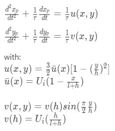
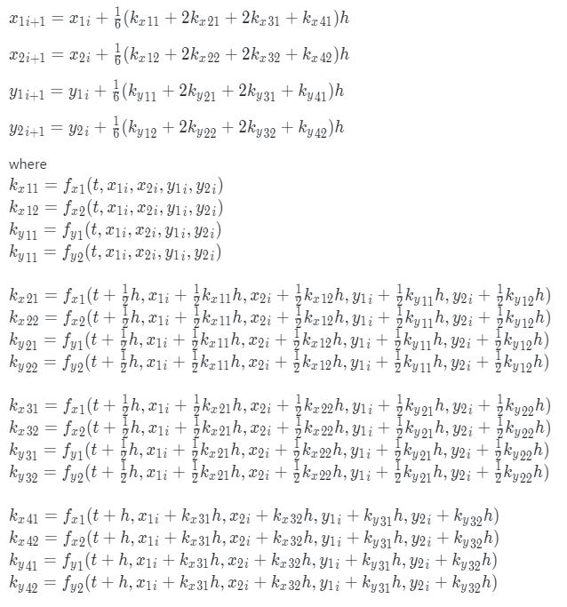

# PARTICLE TRAJECTORY IN PLEATED FILTERS

**Prepared by: Arnaud Debraine**

**Virginia Commonwealth University - Department of Mechanical Engineering**

**EGMN 321-002 - Numerical Methods**

# Contents

- 1 Introduction
   - 1.1 Summary
   - 1.2 Project Statement
- 2 Methodology
   - 2.1 Analysis
   - 2.2 Code description
- 3 Conclusions
   - 3.1 Results
- 4 Appendices
   - 4.1 Appendix A - References
   - 4.2 Appendix B - Formulas
   - 4.3 Appendix C - Output
   - 4.4 Appendix D - Input Code

# 1. Introduction

## 1.1 Summary

Air filters serve many purposes like removing unwanted particles and
cleaning the air as it comes through an air conditioning unit or a car
engine. It is important to understand the properties of air filters in
order to improve performance and increase its range of application. The
purpose of the project was to model the travel path of particles through
an air filter through the use of numerical computation.

## 1.2 Project Statement

In this project, aerosol particles traveled through half a pleat channel
as it was assumed to be symmetrical along the horizontal axis for
simplicity. The model was also geometrically simplified by considering
the pleat channel as having a rectangular shaped xy plane cross-section.
To calculate the position of a particle as it travels through the pleat
channel, the numerical 4th Runge-Kutta method was used. Five particles
entering the pleat channel at different heights were considered. The
expected outcome was a parabolic travel path for each particle.

# 2. Methodology

## 2.1 Analysis

In order to simulate the travel path of a particle through a pleat
channel, the following two second order ODEs were given. 

The two second order ODEs were split in two first order ODEs each using
the method described in **Figure 4.1**. The four resulting
ODEs were solved simultaneously using MATLAB. The final 4th Runge-Kutta
computational model used to solve the problem is described in **Equation 4.1**.

## 2.2 Code description

A separate function file was created to execute the runge-kutta model
described in **Equation 4.1**. It contained a
*while* loop that computes, step by step, the x and y position of a
single particle, with a time step of 0.00001s. The output array was
pre-allocated as a zero array to attempt a faster computation. The
function was used in a *for* loop in the main code file in order to use
the runge-kutta function for all particles needed. The arrays containing
the position values for each particles were equally sized by filling the
smaller arrays with zeros to match the largest array. The x and y
positions for each particles as they travel through the pleat channel
are represented in the graph on **Figure 4.2**. The
positions of the particles were then recorded in a table for each 50th
time steps to shorten the table size, **Appendix C**.

# 3. Conclusions

## 3.1 Results

The graph in **Figure 4.2** shows that the particles
entering at a lower height travel a more horizontal path and travel for
a longer time than the particles entering at a higher height. It also
shows that particles do follow a parabolic travel path as expected.

# 4. Appendices

## 4.1 Appendix A - References

Chapra, Steven C., and Raymond P. Canale. Numerical Methods for
Engineers. New York: McGraw-Hill, 2015. Print.

## 4.2 Appendix B - Formulas

**Equation 4.1. Runge-Kutta fourth order**

**Figure 4.1 Method to split higher order ODE into multiple first order ODEs**

![\[split ode\]Method to split higher order ODE into multiple
first order ODEs](split_ode.PNG "fig:")

## 4.3 Appendix C - Output

**Figure 4.2 Travel Path for Each Particles**

![\[project1_01\]Travel Path for Each
Particles](project1_01.png "fig:")
