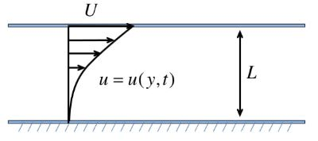
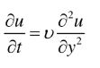
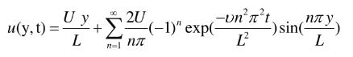
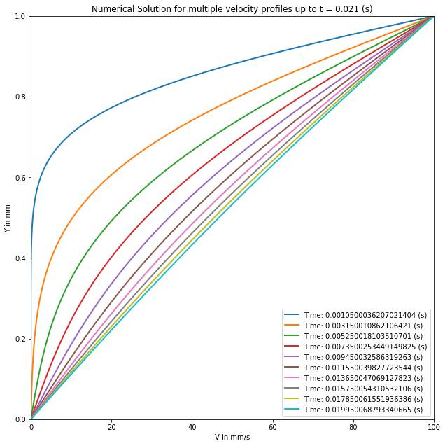
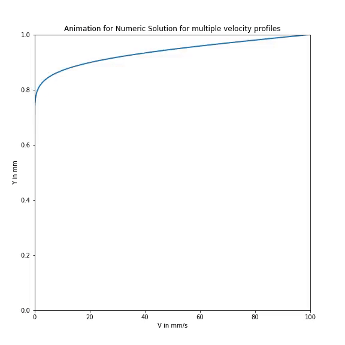

# Unsteady-State Couette Flow Simulation

## Project Description

A simulation of a fluid between two parallel plates. The bottom plate is fixed and the top plate moves at a constant velocity.



Two approaches were used to obtain the velocity profile, a numerical solution using a simplified Navier-Stokes equation and an analytical solution from Fourier series.

The Simplified Navier-Stokes equation:



The Fourier series solution:




##  Results

```python
import numpy as np
import pandas as pd
import matplotlib.pyplot as plt
from IPython.display import HTML
from matplotlib import animation, rc
from mpl_toolkits.mplot3d.axes3d import Axes3D
%matplotlib inline
```

```python
def toint(array):
    array = array.astype(int)
    return array
```

### Inputs


```python
# maximum velocity (m/s)
maximum_velocity = 0.1

# maximum height (m)
maximum_y = 1e-3

# fluid properties for both fluids in (SI units)
mu = 1.8e-5
rho = 1.2047
kinematic_vis1 = mu/rho
mu = mu*100
rho = rho*1000
kinematic_vis2 = mu/rho
```

### Initial Conditions


```python
# time in seconds
maximum_time = 0.021
step_time = 290000
step_y = 600
t = np.linspace(0,maximum_time,step_time)
y = np.linspace(0,maximum_y,step_y)
velocity_profile = np.zeros((step_y,step_time))
velocity_profile[step_y-1][1:] = maximum_velocity
delta_t = maximum_time/step_time
delta_y = maximum_y/step_y
lambda_factor = delta_t*kinematic_vis1/delta_y**2

number_curves = 10
number_curves_movie = 100
fourier_steps = 10
graph_t = np.arange(1,number_curves+1)
```

## First fluid


```python
print('KINEMATIC VISCOSITY = {} in m^2/s \n'.format(kinematic_vis1))
print('LAMBDA = {} \n\n'.format(lambda_factor))

for ti in range(0,step_time-1):
    velocity_profile[1:step_y-1,ti+1] = velocity_profile[1:step_y-1,ti] + lambda_factor*(velocity_profile[2:step_y,ti] - 2*velocity_profile[1:step_y-1,ti] + velocity_profile[0:step_y-2,ti])
pd.DataFrame(velocity_profile)
```

    KINEMATIC VISCOSITY = 1.4941479206441436e-05 in m^2/s 
    
    LAMBDA = 0.38950890620930095 
    
    
    


```python
fig1 = plt.figure(figsize=(10,10))
axes = fig1.add_axes([0.1, 0.1, 0.8, 0.8])
axes.set_xlim(( 0, np.max(velocity_profile)*1000))
axes.set_ylim((0, np.max(y)*1000))
axes.set_title('Numerical Solution for multiple velocity profiles up to t = {} (s)'.format(t[int(step_time*np.max(graph_t)/number_curves-1)]))
axes.set_xlabel('V in mm/s')
axes.set_ylabel('Y in mm')

for graph_t_step in graph_t:
    axes.plot(velocity_profile[0:,int(step_time/number_curves*graph_t_step-step_time/number_curves/2)]*1000,y*1000,lw=2,label='Time: {} (s)'.format(t[int(step_time/number_curves*graph_t_step-step_time/number_curves/2)]))

    axes.legend()
plt.show()

```





```python
fig3 = plt.figure(figsize=(8,8))
ax = fig3.add_axes([0.1, 0.1, 0.8, 0.8])
ax.set_xlim(( 0, np.max(velocity_profile)*1000))
ax.set_ylim((0, np.max(y)*1000))
ax.set_title('Animation for Numeric Solution for multiple velocity profiles')
ax.set_xlabel('V in mm/s')
ax.set_ylabel('Y in mm')
line, = ax.plot([], [], lw=2)
plt.close();

def init():
    line.set_data([], [])
    return (line,)

graph_movie = np.arange(1,number_curves_movie+1)

def animate(i):
    x = velocity_profile[0:,toint(step_time/number_curves_movie*graph_movie[i]-1)]*1000
    y1 = y*1000
    line.set_data(x, y1)
    return (line,)

anim = animation.FuncAnimation(fig3, animate, init_func=init,
                               frames=100, interval=50, blit=True)

HTML(anim.to_html5_video())
```





```python
fig2 = plt.figure(figsize=(10,10))
axes = fig2.add_axes([0.1, 0.1, 0.8, 0.8])
axes.set_xlim(( 0, np.max(velocity_profile)*1000))
axes.set_ylim((0, np.max(y)*1000))
axes.set_title('Fourier Solution for multiple velocity profiles up to t = {} (s)'.format(t[int(step_time*np.max(graph_t)/number_curves-1)]))
axes.set_xlabel('V in mm/s')
axes.set_ylabel('Y in mm')

yi = y[1]
tfourier = np.arange(1,fourier_steps+1)
graph_t_step = 1
sum_fourier = np.array([])

tfourier = np.arange(1,fourier_steps)
sum_fourier = np.array([])
for graph_t_step in graph_t:
    velocity_profile_fourier = np.array([])
    for yi in y:
        sum_fourier = np.array([])
        for ifourier in tfourier:
            sum_fourier = np.append(sum_fourier,2*maximum_velocity/(ifourier*np.pi)*(-1)**ifourier*np.exp(-kinematic_vis1*ifourier**2*np.pi**2*(t[int(step_time/number_curves*graph_t_step-step_time/number_curves/2)])/maximum_y**2)*np.sin(ifourier*np.pi*yi/maximum_y))
        velocity_profile_fourier = np.append(velocity_profile_fourier,maximum_velocity*yi/maximum_y + np.sum(sum_fourier))
    
    axes.plot(velocity_profile_fourier*1000,y*1000,lw=2,label='Time: {} (s)'.format(t[int(step_time/number_curves*graph_t_step-step_time/number_curves/2)]))
    axes.legend()
plt.show()

```


