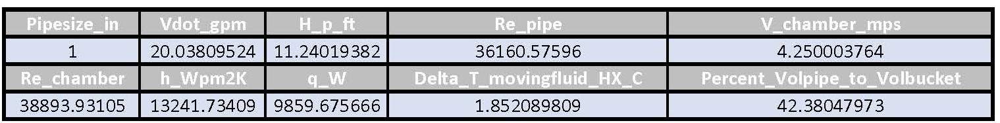

# TSD PROJECT - WATER BOTTLE CHILLER

## Contents

- 1 Introduction
- 2 CAD Design
- 3 Calculations
- 4 Take Aways
- 5 Results

## 1. Introduction

### Project Statement

To design a system using water cooled by ice in an effort to reduce the
temperature of a sealed consumable beverage. We will be utilizing a pump
to circulate chilled water through a pipe system that will include a
heat exchanger capable of holding the beverage. This process will run
for a duration of 5 minutes in an effort to attain the maximum possible
temperature difference in the bottle. To increase the efficiency of the
system we will secure the bottle to a motor-driven input shaft and
induce rotation inside the heat exchanger chamber. The centrifugal
movement of the cooled water will increase the rate of heat transfer
through the plastic boundary, increasing the rate of temperature
reduction.

### Background Research

Consumers in the current market traditionally have only a few readily
available options for cooling consumable liquids. One option is to
utilize an electric refrigerator which can take up to several hours to
reach a desirable temperature. Alternatively one could place the
container in an electric freezer for more rapid cooling, however it can
freeze over if left for too long and possibly fracture the container
depending on the liquid and material. Placing ice cubes in a liquid can
cool it quickly as well, but this method requires a large enough
container to insert and hold the ice without spillage. These options
leave a technological gap for consumers looking to quickly cool their
beverages, and we will be offering our concept as an effective solution.

### Summary

To most effectively design the beverage cooler, iterations of heat
transfer analysis were used to assess different conceptual methods.
Several empirical correlations for heat transfer analysis were used
before finally selecting the Radial Systems with Convection method for
the transient analysis. The inputs to this heat transfer analysis were
iterated to find the most realistic results like the component geometry
and Reynolds number. The optimal diameter of the pipe system was found
after assessing multiple pipe size values using Matlab simulations. This
was done while also taking into consideration the fluid’s mechanical
effects on the design. Bernoulli’s equation was used to find the maximum
head in the system, and how altering the variables would effect which
pump worked best on the system. The ambient temperature of the water
bottle may differ as the room temperature differs making ambient
temperature an important input for the heat transfer analysis. Therefore
different values were taken into consideration to make the results as
accurate as possible.

Once the calculated values were compiled, they were taken and compared
against components currently available offering the lowest feasible cost
for testing. The pump was easy to select once the proper GPM and
pressure head values were quantified from the calculations, however
keeping the cost low while trying to meet the required rate proved
challenging. Selecting a sump pump kept the material cost low and
provided the high operating speeds that the design required. For the
heat exchanger, there were not many prefabricated designs that suited
the requirements so a custom-built design was chosen. Using CAD modeling
and 3D printing, the heat exchanger prototype will be easy to
manufacture and provides the ability to make accurate geometries in a
small amount of time versus hand fabrication. The additional components
required were found with relative ease from local hardware supply stores
like the PVC piping and 5 gallon bucket.

## 2. CAD Design

### Design Overview

**Figure 2.1 The Beverage Cooler**

The final design consists of a pipe system that cycles fluid through the
reservoir and heat exchanger. A set length for the pipe is being used
for testing purposes as the consumer may need to set the device in an
optimal location away from a water source. A sump pump is being utilized
for testing and once a final design is locked in then a readily
available commercial pump can be selected for production purposes. The
heat exchanger has a spiral inner surface that the fluid flow will
follow.

### Pipe System

**Figure 2.2 CAD Design for the Pipe System and Reservoir**

The total testing length of the piping in the design adds up to 13 feet.
All the pipes in the design are PVC pipes that have standard sizes of
3/4 nominal diameter,schedule 40. A 90 degree elbow is used to connect
the the pipe coming from the pump outlet to the transfer pipe. Another
90 degree elbow is connected to the end of the pipe that connects to
outlet of the heat exchanger to control the discharge of the water back
into the reservoir. Adapters and reducers were used to convert the
transfer system to a diameter that produced the necessary pressure to
optimize the pump head.

### Heat Exchanger

**Figure 2.3 CAD Design for the Heat Exchanger**

The heat exchanger was designed to keep the fluid in constant surface
contact with the bottle while minimizing losses in velocity. The inlet
and outlet ports are in-line with the pump to reduce the total number of
elbows in the system. The water will enter the heat exchanger at the
base of the bottle and travel through a spiral pattern that follows the
outside contour of the bottle exiting at the bottle cap. Being that this
is in the design phase we would need to conduct additional testing to
ensure a variety of bottles could be chilled in the chamber as customers
will need flexibility in their applications for the product.

### Rotational System

**Figure 2.4 Bottle Rotational Support Drive**

To create a uniform heat transfer rate through the entire bottle, a
system to rotate the beverage bottle was designed. The bottle will be
placed in the fabricated frame, held by the 4 vertical tabs with inward
mechanical pressure and rotated within the heat exchanger. The
rotational input is provided by an electric motor spinning the bottle in
the opposite direction of the fluid flow, creating a cross-flow heat
exchanger.

### Sump Pump

**Figure 2.5 CAD Design for the Pump**

The pump used in the design is a pedestal sump pump. This pump has a
maximum volumetric flow rate of 3550 GPH at 0 feet of head. However we
reduced the size of the pipes in the system from 1-1/4 inch to 3/4 inch
the head is now at 20 feet dropping the flow rate to 1200 GPH. The
pedestal sump pump was chosen because of it’s physical design which
minimizes the amount of volume displacement in the reservoir and for the
high amount of gallons per minute it pushes through the system. The
inlet of the pump is located at the bottom of the base which reduces the
submerged depth necessary for it to be fully functional. The outlet
pumps the fluid vertically and is located on the upper face of the base.
The pump has a float switch that is used to measure the height of the
fluid in the basin. When the float switch drops below the minimum
operational height for the pump to operate, the pump will automatically
shut off.

## 3. Calculations

### Summary of Results

To achieve the desired flow in the system, 3/4 nom 40 sch piping and a
3550 GPH pump are being used in the design. The dimensions of the pipe
system were finalized after iterations of different diameters and flow
rates were calculated. After analyzing flow, heat transfer analysis was
performed on the heat exchanger. The analysis was performed using the
method of convection to assess an internal fluid flowing through a
square tube. Once the total heat transfer rate was calculated, a
transient heat transfer analysis was conducted. The transient analysis,
which was performed using the convection boundary layer method, resulted
in finding the total change in temperature of the fluid in the water
bottle over a period of 5 minutes.

### Flow in the System

The purpose of the flow calculations was to determine which pump was
needed to deliver a desired volumetric flow rate of 20 gpm and to
determine the velocity of the water inside the heat exchanger. The
modified Bernoulli equation was used to determine the flow in the piping
system with the final output being the head of the pump. The pipe
diameter was iterated from 1/8nom40sch pipes to 3-1/2nom80sch pipes and
the results from these calculations enabled us to select a pipe size
that delivered a head closest to the necessary 20ft. A wider range 
of volumetric flow rates werethen iterated for the selected 
3/4nom40sch pipe. The resulting head values were thencompared to 
several selected pumps, and the Everbuilt pump was selected as it 
delivered 20gpm at 20ft of head. Another consideration for
pump selection was that the amount of water in the bucket had to be
maintained at a certain level for the pump to operate safely .
Therefore, the fluid being pumped out of the bucket had to be returned
at a rate that kept at least 30 percent of the initial volume at all
times.

### Convection Heat Transfer in the Heat Exchanger

The heat transfer analysis was performed using three methods that were
then compared to each other, the methods were external flow over a
cylinder, external flow over a flat plate and internal flow in a square
pipe. The desired output of the heat transfer analysis was a convection
heat transfer coefficient and a heat transfer rate. By comparing these
values it was determined that the more accurate method was the internal
flow in a square pipe. The thermal diameter and the Reynolds number were
calculated allowing us to find a Nussel number that is dependent on
whether the flow was turbulent or laminar. The resulting data was added
to tables for each pipe size, each volumetric flow rate and a variety 
of ambient temperatures.

### Transient Heat Transfer

The transient heat transfer analysis was performed using the convection
boundary condition method. The lumped capacitance was first used to find
a time $t_a$ that was subtracted from the time $t$ acquired from the
convection boundary condition method to insure convergence of the
series. The convection boundary condition method involved a Bessel
function of the first order to calculate a dimensionless form of
temperature to then calculate Fourier’s number that was used to find a
time $t$ for initial bottle temperature ranging from 25 degrees Celsius
to 1 degree Celsius. The calculations were repeated for initial bottle
temperatures ranging from 25 to 20 degrees Celsius.

## 4. Take Aways

The spiral design of the heat exchanger resulted in a higher heat
transfer coefficient than the cross-flow design and thus selected for
the final design. Additionally, turbulence in the flow was proven to
increase the heat transfer rate, therefore a rotational mechanism was
chosen to promote fluid movement within the bottle. A high flow rate
also resulted in a higher heat transfer resulting in the selection of
the 3550 GPH pump. The working feet of head had to be taken into careful
consideration when choosing a pump to meet the desired flow rate.
Therefore, the 3/4 nominal diameter,schedule 40 was pipe was chosen as
the reduction in diameter resulted in an operational pressure increase.

## 5. Results

**Figure 5.1 Temperature vs Time Graphs**

**Table 5.1 Assumptions**

**Table 5.2 First Assumptions Calculations**

**Table 5.3 Pipe Size Iterations**

**Table 5.4 Volumetric Flow Rate Iterations**

**Table 5.5 Ambient Temperature Iterations**

**Table 5.6 Transient Heat Transfer at 25C ambient Temperature**

**Table 5.7 Transient Heat Transfer at 24C ambient Temperature**

**Table 5.8 Transient Heat Transfer at 23C ambient Temperature**

**Table 5.9 Transient Heat Transfer at 22C ambient Temperature**

**Table 5.10 Transient Heat Transfer at 21C ambient Temperature**

**Table 5.11 Pump Comparison Data**

**Table 5.12 Chosen Pump Data**